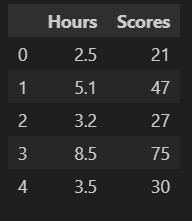
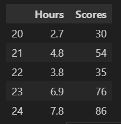
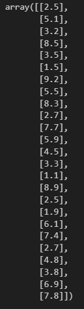
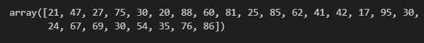
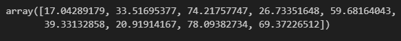
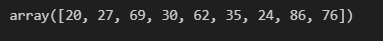
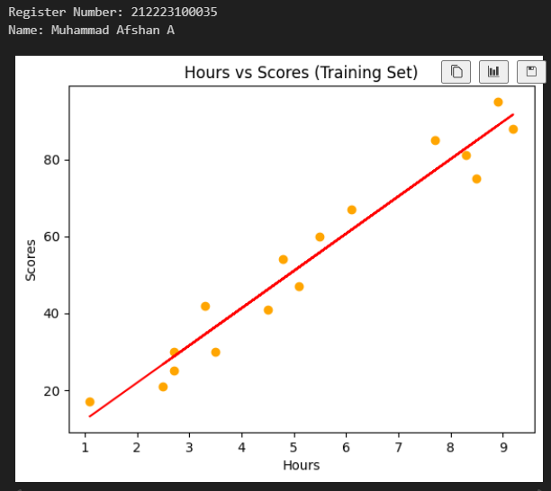
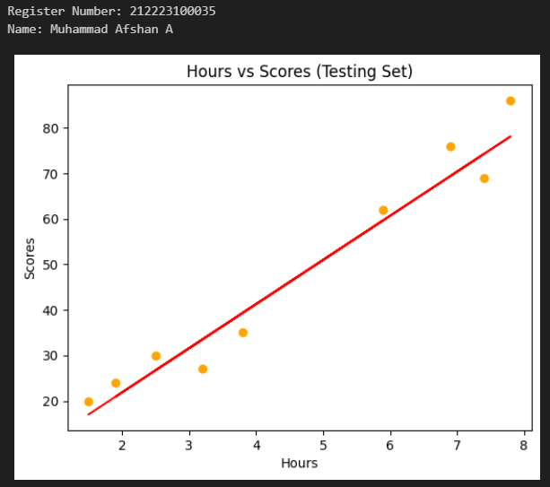
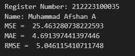

# Implementation-of-Simple-Linear-Regression-Model-for-Predicting-the-Marks-Scored

## AIM:
To write a program to predict the marks scored by a student using the simple linear regression model.

## Equipments Required:
1. Hardware – PCs
2. Anaconda – Python 3.7 Installation / Jupyter notebook

## Algorithm

1.Import the standard Libraries.

2.Set variables for assigning dataset values. 

3.Import linear regression from sklearn. 

4.Assign the points for representing in the graph. 

5.Predict the regression for marks by using the representation of the graph. 

6.Compare the graphs and hence we obtained the linear regression for the given datas.


## Program:
```python
#Program to implement the simple linear regression model for predicting the marks scored.
#Developed by: Muhammad Afshan A
#RegisterNumber:  212223100035
import pandas as pd
import numpy as np
import matplotlib.pyplot as plt
from sklearn.metrics import mean_absolute_error
from sklearn.metrics import mean_squared_error


#read csv file
df=pd.read_csv('student_scores.csv')
#displaying the content in datafile
df.head()
```

## Output:


---
```python
df.tail()
```

## Output:


---
```python
X=df.iloc[:,:-1].values
X
```

## Output:


---
```python
y=df.iloc[:,1].values
y
```

## Output:


---
```python
from sklearn.model_selection import train_test_split
X_train,X_test,Y_train,Y_test=train_test_split(x,y,test_size=1/3,random_state=0)
from sklearn.linear_model import LinearRegression
regressor=LinearRegression()
regressor.fit(X_train,Y_train)
Y_pred=regressor.predict(X_test)
Y_pred
```

## Output:


---
```python
Y_test
```

## Output:


---
```python
#graph plot for training data
print("Register Number: 212223100035")
print("Name: Muhammad Afshan A")
plt.scatter(X_train,Y_train,color="orange")
plt.plot(X_train,regressor.predict(X_train),color="red")
plt.title("Hours vs Scores (Training Set)")
plt.xlabel("Hours")
plt.ylabel("Scores")
plt.show()
```
## Output:


---
```python
#graph plot for test data
print("Register Number: 212223100035")
print("Name: Muhammad Afshan A")
plt.scatter(X_test,Y_test,color="orange")
plt.plot(X_test,Y_pred,color="red")
plt.title("Hours vs Scores (Testing Set)")
plt.xlabel("Hours")
plt.ylabel("Scores")
plt.show()
```
## Output:

---
```python
#find mae,mse,rmse
print("Register Number: 212223100035")
print("Name: Muhammad Afshan A")
mse=mean_squared_error(Y_test,Y_pred)
print('MSE = ',mse)
mae=mean_absolute_error(Y_test,Y_pred)
print('MAE = ',mae)
rmse=np.sqrt(mse)
print('RMSE = ',rmse)
```

## Output:

---

## Result:
Thus the program to implement the simple linear regression model for predicting the marks scored is written and verified using python programming.
